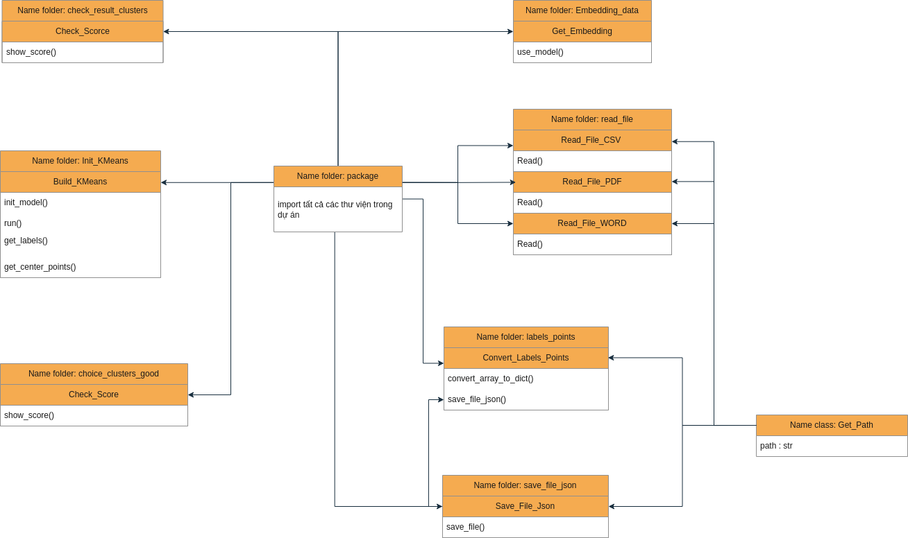

# 📘 Building a Physics Problem Solving System
## 🚀 Giới thiệu  
Dự án **Chatbot giải bài tập Vật lý** được phát triển bởi team AI. Hệ thống được thiết kế dưới dạng một website chatbot, sử dụng kỹ thuật **RAG (Retrieval-Augmented Generation) , Multi LLM, Fine-turning Model, AI Agent**

## 👨‍💻 Thành viên nhóm

| Họ tên             | Vị trí - Vai trò                            |
|--------------------|------------------------------------|
| **Phạm Văn Hùng**  | Leader  - Thiết kế hệ thống RAG , fine-turning model, viết package , clean data, tạo Multi Agent.       |
| **Vũ Đức Hải**     | Leader - Thiết kế & Triển khai Web. |
| **Nguyễn Ngọc Hải**  | Thành viên - Clean data, viết package.
| **Trần Hữu Phúc**  | Thành viên - Crawl data.                         |
| **Đàm Xuân Long**| Thành viên - Clean data.                         |

---
### Version 1:
Công nghệ sử dụng: RAG + fine turning model sử dụng QLora 4bit trên bộ dữ liệu khoảng 2k câu hỏi.

### Version 2:
Để tối ưu cho khả năng suy luận thì mình sử dụng AI Agent.

## 💡 Ý tưởng tổng quan


## 🧩 Viết package (Nguyễn Ngọc Hải & Phạm Văn Hùng)


## 🌐 Thiết kế & Triển khai Web (Vũ Đức Hải & Phạm Văn Hùng)


# Hướng dẫn chạy mô hình Qwen3-0.6B với file `test_model.py`

## 1. Mô tả
File `test_model.py` cho phép bạn tương tác với mô hình ngôn ngữ Qwen3-0.6B để giải đáp các câu hỏi vật lý trắc nghiệm theo chuẩn chuyên gia, với hướng dẫn chi tiết từng bước giải.

## 2. Yêu cầu hệ thống
- Python >= 3.8
- Kết nối Internet để tải mô hình từ HuggingFace lần đầu
- RAM tối thiểu 4GB (khuyến nghị 8GB+)

## 3. Cài đặt môi trường
### a. Tạo môi trường ảo (khuyến nghị)
```bash
python3 -m venv venv
source venv/bin/activate
```

### b. Cài đặt các thư viện cần thiết
Đảm bảo file `requirements.txt` đã được cập nhật đúng:
```bash
pip install -r requirements.txt
```

**Lưu ý:**
- Đã sử dụng bản torch CPU-only (`torch==2.7.1+cpu`) để tránh lỗi CUDA/NCCL, phù hợp cho máy không có GPU hoặc không cài CUDA.
- `transformers==4.53.3` và `accelerate==1.9.0` là các bản mới nhất đã kiểm tra tương thích.

## 4. Chạy chương trình
```bash
python3 test_model.py
```
- Lần đầu chạy sẽ mất thời gian tải mô hình (~1.5GB).
- Sau khi tải xong, chương trình sẽ hỏi bạn nhập câu hỏi vật lý.
- Nhập câu hỏi và nhấn Enter để nhận lời giải chi tiết.

## 5. Một số lỗi thường gặp
- **Lỗi ImportError liên quan CUDA/NCCL:**
  - Đảm bảo đã cài torch bản CPU-only như hướng dẫn trên.
- **Lỗi thiếu accelerate:**
  - Cài đặt bằng: `pip install accelerate`
- **Lỗi thiếu transformers:**
  - Cài đặt bằng: `pip install transformers`

## 6. Tùy chỉnh prompt hệ thống
Bạn có thể chỉnh sửa biến `system` trong file `test_model.py` để thay đổi hướng dẫn cho mô hình.

## 7. Tham khảo thêm
- [Qwen3-0.6B trên HuggingFace](https://huggingface.co/Qwen/Qwen3-0.6B)
- [Tài liệu PyTorch](https://pytorch.org/)
- [Tài liệu Transformers](https://huggingface.co/docs/transformers)

---
Nếu gặp vấn đề khi cài đặt hoặc chạy, hãy kiểm tra lại các bước trên hoặc liên hệ hỗ trợ.

